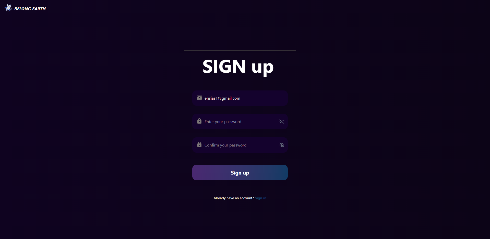
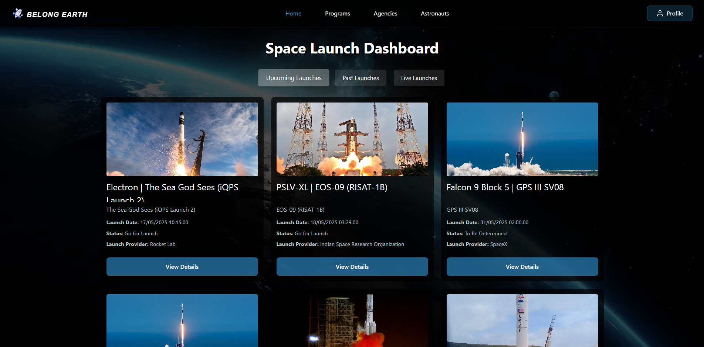
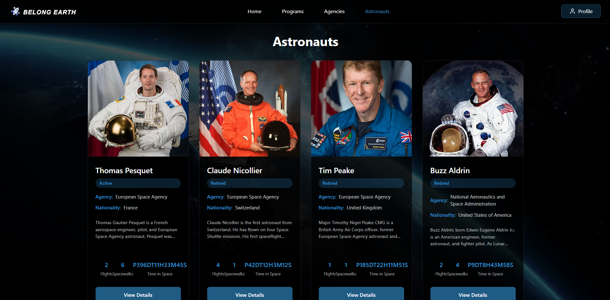

# 🚀 Belong Earth – Space Launch Dashboard

Real-time insights into humanity’s journey beyond Earth. **Belong Earth** aggregates data from public launch APIs and space-agency feeds to give you a beautiful, always-up-to-date dashboard of upcoming, live and historical rocket launches – plus deep dives into vehicles, missions, agencies and astronauts.

---

## ✨ Key Features

| Category | Description |
|----------|-------------|
| **Real-Time Launch Tracking** | Live feed of launches worldwide, auto-refreshing every 60 s. Switch between **Upcoming**, **Past** and **Live** tabs. Interactive countdown timer updates down to the second. |
| **Mission Cards** | Each card shows rocket ✈️ name, mission title, launch provider, launchpad, current status (Go / Hold / TBD) and a hero image. |
| **Detailed Mission View** | Click **View Details** to open a modal with payload specs, orbital parameters, webcast links, NOTAMs and live telemetry (if available). |
| **Astronaut Explorer** | Browse an atlas of active and retired astronauts – filter by agency/nationality, view biographies, total flights, EVAs and cumulative time in space. |
| **Agency & Program Pages** | Organised profiles for NASA, SpaceX, ESA, ISRO, CNSA and more: fleet overview, historic missions, budgets and launch-cadence graphs. |
| **Search & Filters** | Fuzzy search across rockets, payloads, agencies and astronauts. Combine filters (date range, orbit class, provider) for fast drill-down. |
| **Responsive UI** | Tailored layouts for desktop, tablet and mobile. Dark-mode first, with automatic theming. |
| **Secure Auth** | JWT-based Spring Security with role-based access (admin/editor/viewer). |
| **Admin Console** | Protected React panel for managing cached launch data, triggering manual syncs and adding custom content. |

---

## 🏗️ Tech Stack

- **Frontend:** React 18 · TypeScript · Tailwind CSS  
- **Backend:** Java Spring Boot 3 · Spring Security  
- **Database:** PostgreSQL 16  

*(Built exactly with the technologies you specified.)*

---

## 📸 Screenshots
> _SIGNUP page_  
>   
> _Home – Upcoming Launches_  
>   
> _Astronaut Explorer_  
> 

  

