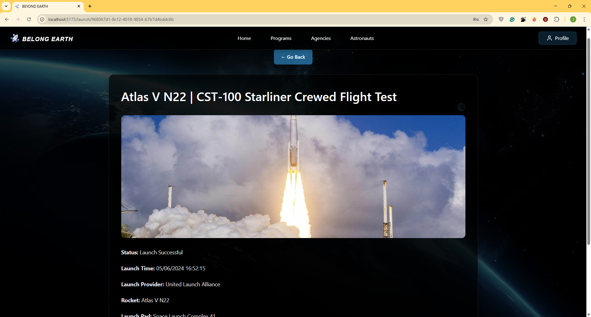

# 🚀 Belong Earth – Space Launch Dashboard

Real-time insights into humanity’s journey beyond Earth. **Belong Earth** aggregates data from public launch APIs and space-agency feeds to give you a beautiful, always-up-to-date dashboard of upcoming, live and historical rocket launches – plus deep dives into vehicles, missions, agencies and astronauts.

---

## ✨ Key Features

| Category | Description |
|----------|-------------|
| **Real-Time Launch Tracking** | Live feed of launches worldwide, auto-refreshing every 60 s. Switch between **Upcoming**, **Past** and **Live** tabs. Interactive countdown timer updates down to the second. |
| **Mission Cards** | Each card shows rocket ✈️ name, mission title, launch provider, launchpad, current status (Go / Hold / TBD) and a hero image. |
| **Detailed Mission View** | Click **View Details** to open a modal with payload specs, orbital parameters, webcast links, NOTAMs and live telemetry (if available). |
| **Astronaut Explorer** | Browse an atlas of active and retired astronauts – filter by agency/nationality, view biographies, total flights, EVAs and cumulative time in space. |
| **Agency & Program Pages** | Organised profiles for NASA, SpaceX, ESA, ISRO, CNSA and more: fleet overview, historic missions, budgets and launch-cadence graphs. |
| **Search & Filters** | Fuzzy search across rockets, payloads, agencies and astronauts. Combine filters (date range, orbit class, provider) for fast drill-down. |
| **Responsive UI** | Tailored layouts for desktop, tablet and mobile. Dark-mode first, with automatic theming. |
| **Secure Auth** | JWT-based Spring Security with role-based access (admin/editor/viewer). |
| **Admin Console** | Protected React panel for managing cached launch data, triggering manual syncs and adding custom content. |

---
## 🛠️ Tech Stack

### Frontend
- **React 18** with **TypeScript**
- **React Router** for navigation
- **Tailwind CSS** for styling
- **React Toastify** for notifications
- **Vite** as build tool (running on port 5173)

### Backend
- **Spring Boot** (Java)
- **Spring Security** for authentication and authorization
- **Spring Web** for REST API
- **BCrypt** for password encryption
- **SLF4J** for logging
- **CORS** configuration for cross-origin requests

### Database
- Relational database (PostgreSQL )
- JPA/Hibernate for ORM

### External APIs
- Space data integration via external API
    - API externe : The Space Devs
      Rôle : Fournit des données sur les lancements de fusées.

## 📋 Prerequisites

Before running this application, make sure you have the following installed:

- **Node.js** (v16 or higher)
- **npm** 
- **Java 17** or higher
- **Maven**
- **Database** (PostgreSQL)

## 🚀 Getting Started

### Backend Setup

1. **Clone the repository**
    ```bash
    git clone https://github.com/m-elhamlaoui/development-platform-jihane.git
    cd development-platform-jihane
2. **Navigate to the backend directory**
   ```bash
   cd backend


## 📸 Screenshots
> _SIGNUP page_  
>   

> _Welcome page_  
>  
The landing page of the application, featuring navigation and a brief overview of space data categories,
First page users see with a welcoming message and navigation options to explore the app
> _This image shows the continuation of the Welcome interface_
>  
**Home page Space Launch Dashboard:**
> _Incoming Launches_
>  

> _Past Launches_
>   
Lists completed launches with archived details such as date, success status, and mission outcome.

>_live Launches_
>  
Shows a real-time or upcoming list of rocket launches, often with countdowns or launch times.

> _Launche Details_  
> 
Provides comprehensive information about a specific rocket launch including the rocket, pad, mission, and status
>_Space Programs Overview_
> 
Presents different space programswith their objectives, timelines, and agencies involved.
>_Program Details Page_
> 
>_Agencies Overview_
> 
Lists all space agencies in a card/grid view with basic information and a button to view more details.
>_Agency Details Page_
> 
 Displays detailed information about a selected space agency
>_Astronaut Directory_
> 
 Displays a searchable list of astronauts with their names, images, and links to view their details.
>_Astronaut Profile_
> 
 Shows detailed information about a selected astronaut including biography, missions,  nationality 


>_User Profile Page_
> 


