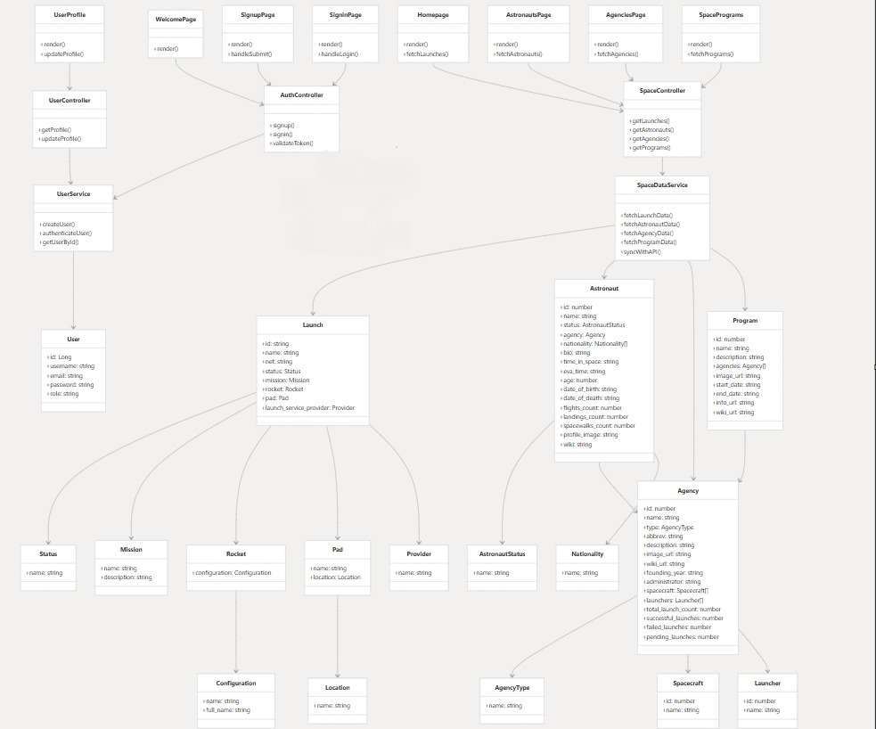
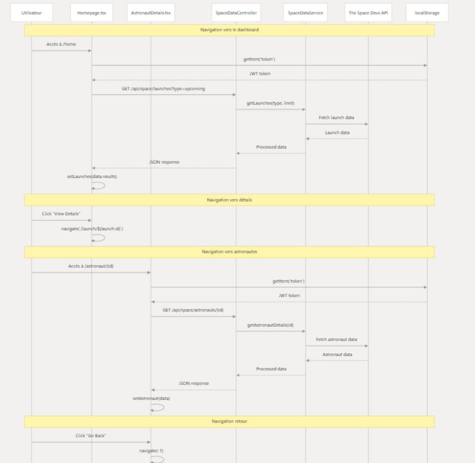
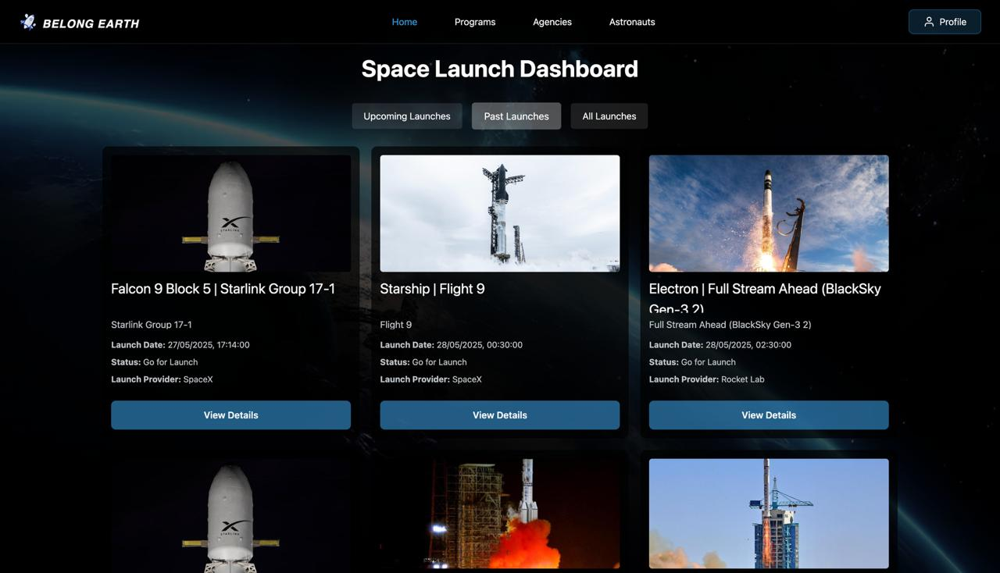
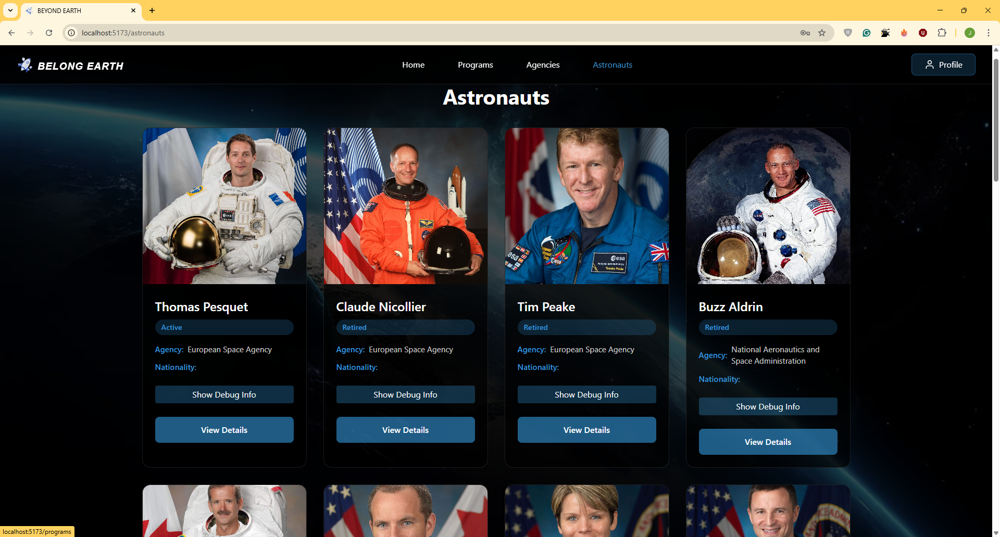

# 🚀 Beyong Earth – Space Launch Dashboard

Real-time insights into humanity’s journey beyond Earth. **Belong Earth** aggregates data from public launch APIs and space-agency feeds to give you a beautiful, always-up-to-date dashboard of upcoming, live and historical rocket launches – plus deep dives into vehicles, missions, agencies and astronauts.
A full-stack space exploration platform that enables user registration, authentication, and access to real-time space mission data through external APIs.


## 📊 Overview

Belong-earth is a containerized web application that provides users with secure access to space mission data including launches, astronauts, agencies, and space programs. The platform integrates with The Space Devs API while maintaining its own user management system.

## ✨ Key Features

* User registration and authentication  
* Real-time space launch data  
* Astronaut profiles and information  
* Space program details and mission patches  
* Responsive web interface with modern UI components  

| Category | Description |
|----------|-------------|
| **Real-Time Launch Tracking** | Live feed of launches worldwide, auto-refreshing every 60 s. Switch between **Upcoming**, **Past** and **Live** tabs. Interactive countdown timer updates down to the second. |
| **Mission Cards** | Each card shows rocket ✈️ name, mission title, launch provider, launchpad, current status (Go / Hold / TBD) and a hero image. |
| **Detailed Mission View** | Click **View Details** to open a modal with payload specs, orbital parameters, webcast links, NOTAMs and live telemetry (if available). |
| **Astronaut Explorer** | Browse an atlas of active and retired astronauts – filter by agency/nationality, view biographies, total flights, EVAs and cumulative time in space. |
| **Agency & Program Pages** | Organised profiles for NASA, SpaceX, ESA, ISRO, CNSA and more: fleet overview, historic missions, budgets and launch-cadence graphs. |
| **Search & Filters** | Fuzzy search across rockets, payloads, agencies and astronauts. Combine filters (date range, orbit class, provider) for fast drill-down. |
| **Responsive UI** | Tailored layouts for desktop, tablet and mobile. Dark-mode first, with automatic theming. |


## Architecture

### Backend
* Framework: Spring Boot 3.4.5 with Java 17  
* Database: PostgreSQL with Spring Data JPA  
* External APIs: RestTemplate for The Space Devs API integration  
* Security: Spring Security

### Frontend
* Framework: React 19.1.0 with TypeScript package.json:17-18  
* Build Tool: Vite 6.2.0 package.json:35  
* Styling: Tailwind CSS 4.1.3 package.json:22  
* HTTP Client: Fetch for API communication package.json:14 
### Overall System Architecture
> 

 

# 📐 Diagrammes de Conception 

Ce dossier contient les diagrammes de conception du projet **Belong-earth**, représentant les interactions entre l'utilisateur et le système, ainsi que l'architecture logicielle globale.

## 🗂 Contenu des diagrammes

### 1. Diagramme de cas d'utilisation (Use Case Diagram)
>  

### 2. Diagramme de classes (Class Diagram)
>  

### 3. Diagramme de séquence (Sequence Diagram)
- **Authentification** 
>  
- **Navigation utilisateur dans l’application Belong-earth** 
>  

##  🛠️Technology Stack

| Component               | Technology      | Version  |
|------------------------|-----------------|----------|
| Backend Framework      | Spring Boot     | 3.4.5    |
| Frontend Framework     | React           | 19.1.0   |
| Build Tool (Frontend)  | Vite            | 6.2.0    |
| Styling                | Tailwind CSS    | 4.1.3    |
| Database               | PostgreSQL      | 42.7.5   |
| HTTP Client            | Axios           | 1.9.0    |
| Authentication         | Firebase        | 11.6.1   |

## 🚀Getting Started

### 📋 Prerequisites
* Java 17+  
* Node.js 18+  
* PostgreSQL database  
* Maven 3.6+  
1. **Clone the repository**
    ```bash
    git clone https://github.com/m-elhamlaoui/development-platform-jihane.git
    cd development-platform-jihane
2. **Backend Setup**
    ```bash
    cd backend  
    ./mvnw spring-boot:run

3. **Frontend Setup**
    ```bash
    cd frontend  
    npm install  
    npm run dev

The frontend development server runs on port 5173, while the backend API serves on port 8080.


---


## 🔗API Integration

The application integrates with The Space Devs API (lldev.thespacedevs.com) to provide:

- Launch schedules and details
- Astronaut information 
- Space program data  
- Mission details and imagery  

## 📦Deployment

The application supports containerized deployment using Docker and Kubernetes configurations. 


## 📸 Screenshots

> _Welcome page_  
>  
The landing page of the application, featuring navigation and a brief overview of space data categories,
First page users see with a welcoming message and navigation options to explore the app

> _This image shows the continuation of the Welcome interface_
>  

> _SIGNUP page_  
>   

> _SIGNIN page_  
> 
 
**Home page Space Launch Dashboard:**
> _Incoming Launches_
>  

> _Past Launches_
>   
Lists completed launches with archived details such as date, success status, and mission outcome.

>_All Launches_
>  
Shows a past or upcoming list of rocket launches, often with countdowns or launch times.

> _Launche Details_  
> 
Provides comprehensive information about a specific rocket launch including the rocket, pad, mission, and status

>_Space Programs Overview_
> 
Presents different space programswith their objectives, timelines, and agencies involved.

>_Program Details Page_
> 

>_Agencies Overview_
> 
Lists all space agencies in a card/grid view with basic information and a button to view more details.

>_Agency Details Page_
> 
 Displays detailed information about a selected space agency.

>_Astronaut Directory_
> 
 Displays a searchable list of astronauts with their names, images, and links to view their details.

>_Astronaut Profile_
> 
 Shows detailed information about a selected astronaut including biography, missions,  nationality .


>_User Profile Page_
> 


## 🎥 Demo Vidéo

You can watch the application demonstration video here:

👉 [Watch the demo on Google Drive](https://drive.google.com/file/d/12JshbY_Czv1BRdPIACmoKlsrCQt2VHrE/view?usp=drive_link)


# ( Devops Overview)


### Kubernetes Infrastructure

The application runs on a Kubernetes cluster using Minikube for local development.

[

To ensure full observability of our spatial application, we implemented a modern monitoring infrastructure based on Spring Boot Actuator, Prometheus and Grafana, enabling real-time monitoring of performance, service health and business metrics.

[

### CI/CD Pipeline

Our Jenkins pipeline includes:

1. **Environment Setup**
2. **Chekout**
3. **Build Docker Images**
4. **Docker Login**
5. **Push to Registry**
6. **Post Actions**

[